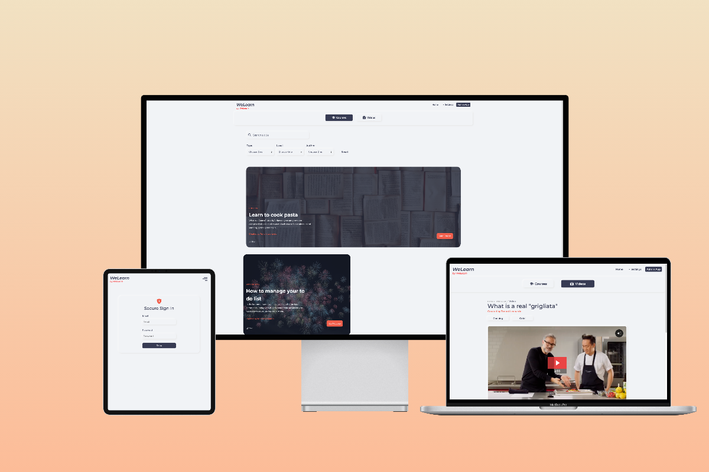

Before finding my first job in tech, I always thought that to grow my experience was necessary to make a bigger project, with front-end and back-end code. I thought to build a video course platform where people could add content in an admin interface, and then interact with it on the front web app.

### How is made it?

- Gatsby
- Netlify
- Apollo
- Firebase Firestore
- Firebase Auth

At the time I was interested to understand Apollo and GraphQL, for that the weird union of Firestore and Apollo.

### Why I built it?

I built it to challenge my self on making a full web app with new technologies, developing the front end and the back end. Also, at that time I was intrigued to sell the product at some friends in the poker community (read about me to understand more).

Below a short video of how the admin app works and you can find the follow functionalities:

1. Authentication (Firebase).
2. Creation of new users.
3. A profile section where each user can modify their credentials.
4. The user receives an email with password and username.
5. A section where upload and add new videos.
6. The course creation, where the user can add different modules with a live preview component.

<iframe src="https://fast.wistia.net/embed/iframe/x5863jmz3c?videoFoam=true" title="Admin Trailer Video" allow="autoplay; fullscreen" allowtransparency="true" frameborder="0" scrolling="no" class="wistia_embed" name="wistia_embed" allowfullscreen msallowfullscreen width="100%" height="100%" style="border-radius:20px; max-width: 720px;max-height: 480px;"></iframe>

This is the front web app, where the end user can enjoy what the app offer, like a video and course library, with filters and a search bar component.

<iframe src="https://fast.wistia.net/embed/iframe/pclej2m5yq?videoFoam=true" title="App Trailer Video" allow="autoplay; fullscreen" allowtransparency="true" frameborder="0" scrolling="no" class="wistia_embed" name="wistia_embed" allowfullscreen msallowfullscreen width="100%" height="100%" style="border-radius:20px; max-width: 720px;max-height: 480px;"></iframe>

### What I've learned?

I learned how to structure a big project. The most important lesson learned was how to don't structure a project. Wrong decisions about the tech stack bring to unnecessary complexity. I could very well have just used Firebase Firestore API to query and mutate data.
